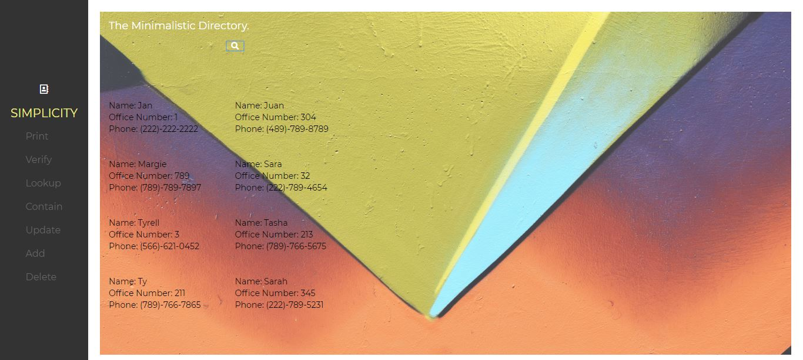

# Contact Directory 

This application functionality:
* Print all seeded contact list.
* Verify if input name is in contact list.
* Lookup up a name seeded contact list.
* Search for any names that match with input strings.
* Update information from seeded contact list.
* Delete a contact in contact list if name input match.

The front-end only application uses HTML, CSS, and JavaScript.
